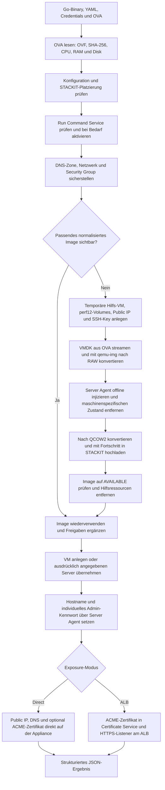
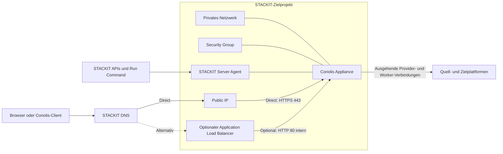

# Coriolis STACKIT Installer

[English](README.md) | **Deutsch**

Der Coriolis STACKIT Installer stellt eine Cloudbase Coriolis Appliance aus einer
OVA reproduzierbar in einem STACKIT-Projekt bereit. Der komplette Ablauf wird von
einem Go-Binary gesteuert. Terraform, die STACKIT CLI, eine serielle Konsole und
manuelle Schritte in der WebConsole sind nicht erforderlich.

Als Eingaben genügen im Normalfall:

- ein STACKIT Service-Account-Key,
- die ID des Zielprojekts,
- die gewünschte STACKIT-Region,
- das Coriolis-OVA,
- eine YAML-Datei für die projektspezifischen Einstellungen.

Kommandozeilenparameter können ausgewählte YAML-Werte überschreiben. Wiederholte
Aufrufe sind vorgesehen: Der Installer findet bereits angelegte Ressourcen wieder,
setzt unterbrochene Image-Importe fort und erzeugt nicht bei jedem Lauf eine neue VM.
Die Auflösungsreihenfolge lautet: eingebaute Defaults, danach YAML, danach explizite
CLI-Parameter.

## Funktionsumfang

Der Installer kann:

- OVF-Metadaten und SHA-256 des OVA lokal ermitteln;
- Availability Zone und Machine Type gegen die OVA-Anforderungen prüfen;
- den STACKIT Run-Command-Dienst bei Bedarf projektweit aktivieren;
- ein neues oder vorhandenes Netzwerk verwenden;
- eine Security Group anlegen und fehlende Ingress-Regeln ergänzen;
- die VMDK ohne lokale Extraktion auf eine temporäre STACKIT-Hilfs-VM streamen;
- die Appliance auf performanten STACKIT-Volumes konvertieren und normalisieren;
- den STACKIT Server Agent offline in das Appliance-Dateisystem integrieren;
- ein wiederverwendbares QCOW2-Image mit Fortschrittsanzeige importieren;
- Images automatisch anhand des OVA-Hashs finden und wiederverwenden;
- Images mit Projekten oder der Parent Organization teilen;
- ein zentrales Image-Projekt und davon getrennte Zielprojekte verwenden;
- eine neue VM erzeugen oder einen ausdrücklich angegebenen Server übernehmen;
- eine freie, neue oder ausdrücklich angegebene Public IP zuordnen;
- eine STACKIT-DNS-Zone sowie den A-Record anlegen oder aktualisieren;
- ein individuelles Admin-Kennwort generieren oder ein vorgegebenes setzen;
- ein öffentlich vertrauenswürdiges Zertifikat per ACME DNS-01 direkt in der
  Appliance installieren;
- alternativ einen STACKIT Application Load Balancer mit TLS-Terminierung anlegen;
- temporäre Hilfsressourcen nach einem erfolgreichen Image-Import entfernen.

Der Installer ist kein Coriolis-Upgrade-Werkzeug. Eine neue OVA ersetzt keinen
zustandsbehafteten Server und migriert weder Lizenz noch Projekte, Endpoints oder
Transferdaten. Ein bestehender Server wird niemals automatisch gelöscht oder durch
ein neues Image ersetzt.

## Ablaufübersicht



Das resultierende Laufzeitmodell sieht so aus:



## Einstellungen auf einen Blick

| Bereich | High-Level-Entscheidung | Typische Einstellung |
|---|---|---|
| Ziel | Projekt und Region | `project_id`, `region` |
| Image | Automatisch finden, explizite ID oder zentrales Image-Projekt | `image.id`, `image.owner_project_id` |
| Image-Freigabe | Keine, einzelne Projekte oder gesamte Organisation | `image.share.*` |
| Compute | Availability Zone, Machine Type und Boot-Disk | `server.*` |
| Performance | Performanceklasse der Appliance- und Normalisierungsdisks | `server.performance_class`, `normalization.performance_class` |
| Netzwerk | Vorhandenes Netzwerk oder automatisch angelegtes Netzwerk | `network.id` oder `network.name` |
| Firewall | Erlaubte eingehende Ports und Quellnetze | `security_group.ingress` |
| Public IP | Automatisch, vorhandene ID/Adresse oder keine | `public_ip`, `public_ip_id`, `public_ip_address` |
| DNS | Zone finden/anlegen und A-Record verwalten | `dns.*` |
| Login | Kennwort generieren oder vorgeben | `bootstrap.*` |
| HTTPS | Direktes Appliance-Zertifikat oder optionaler ALB | `exposure.*` |
| Laufzeit | Timeout je Hauptphase, Polling und Upload-Wiederholungen | `timeout`, `poll_interval`, `upload_attempts` |

## Typische Laufzeiten

Die folgenden Werte sind Richtwerte für das derzeitige OVA mit ungefähr 7 GiB
komprimierter VMDK, Normalisierungsvolumes der Klasse `storage_premium_perf12` und
einer stabilen Internetverbindung. STACKIT-Auslastung, lokale Uploadbandbreite,
OVA-Größe und Storageklasse können die Zeiten deutlich verändern.

| Schritt | Typische Dauer | Wichtigster Einfluss |
|---|---:|---|
| OVA lesen, OVF auswerten und SHA-256 bilden | 30 Sekunden–3 Minuten | lokale Diskgeschwindigkeit |
| Credentials, Platzierung und Run Command Service prüfen/aktivieren | 30 Sekunden–3 Minuten | erstmalige Serviceaktivierung |
| DNS-Zone, Netzwerk und Security Group sicherstellen | 1–4 Minuten | Anzahl neu anzulegender Ressourcen |
| Normalisierungsvolumes und Hilfs-VM starten | 3–10 Minuten | VM-/Volume-Provisionierung und Agent-Start |
| VMDK aus dem OVA zur Hilfs-VM übertragen | 8–30 Minuten | lokale Uploadbandbreite; bei 7 GiB etwa 10 Minuten mit 100 Mbit/s netto |
| VMDK nach RAW konvertieren | 3–15 Minuten | OVA-Format und Volume-Performanceklasse |
| Appliance offline normalisieren | 1–5 Minuten | Dateisystemprüfung und Agent-Installation |
| RAW nach QCOW2 konvertieren und hochladen | 8–30 Minuten | Datenbelegung, CPU und Volume-Performanceklasse |
| STACKIT-Image bis `AVAILABLE` verarbeiten | 3–15 Minuten | Image-Service-Auslastung |
| Appliance-VM booten und Server Agent abwarten | 3–10 Minuten | Boot und erstmalige Agent-Registrierung |
| Kennwort, Public IP, DNS und direktes Zertifikat konfigurieren | 2–10 Minuten | DNS-Propagation und ACME |
| Optionalen ALB bereitstellen | zusätzlich 5–15 Minuten | ALB- und Listener-Provisionierung |

Damit ergeben sich folgende Größenordnungen:

- erster vollständiger Import mit direktem HTTPS: meistens **40–100 Minuten**;
- Deployment mit bereits normalisiertem oder geteiltem Image: meistens **8–25 Minuten**;
- idempotenter Folgelauf ohne wesentliche Änderungen: meistens **2–10 Minuten**;
- ALB-Modus: zusätzlich ungefähr **5–15 Minuten**.

Das konfigurierte `timeout` ist eine technische Obergrenze für jede einzelne
Hauptphase und nicht mehr für die Summe des vollständigen Deployments. Dadurch kann
ein langer erstmaliger Image-Import nicht das später für Bootstrap oder
Zertifikatsinstallation benötigte Zeitbudget aufbrauchen. Wenn eine einzelne Phase
wie die Image-Normalisierung länger als 90 Minuten dauern kann, sollte der Wert auf
`120m` oder `150m` erhöht werden. `storage_premium_perf1` kann insbesondere die
beiden Konvertierungsschritte stark verlängern; die Schätzungen basieren auf
`perf12`.

### Fortschrittsausgabe

Jede Deployment-Phase schreibt ihren Status nach stderr:

```text
[START] Finding or creating Coriolis appliance server
[WAIT ] Finding or creating Coriolis appliance server (elapsed 40s)
[DONE ] Finding or creating Coriolis appliance server (elapsed 53s)
```

Lange Phasen werden in eindeutige Teilphasen zerlegt. Eine Abschlussmeldung gilt
immer nur für die zugehörige Startmeldung und bedeutet nicht automatisch, dass das
gesamte Deployment fertig ist. Nach dem abgeschlossenen Datenupload beginnt daher
beispielsweise sofort sichtbar die separate Verarbeitung durch die STACKIT
Control-Plane:

```text
[INFO ] Image data upload completed; STACKIT control-plane image processing follows
[DONE ] Converting normalized disk and uploading image data (elapsed 18m12s)
[START] Waiting for STACKIT image 8c405fdd-... to become AVAILABLE
[INFO ] Waiting for STACKIT image 8c405fdd-... to become AVAILABLE: current status CREATING (elapsed 1s)
[WAIT ] Waiting for STACKIT image 8c405fdd-... to become AVAILABLE: current status CREATING (elapsed 40s)
[DONE ] Waiting for STACKIT image 8c405fdd-... to become AVAILABLE (elapsed 20m3s)
```

Wenn keine andere sichtbare Aktivität stattfindet, meldet sich alle 20 Sekunden die
aktuell aktive und spezifischste Teilphase. Beim Polling werden außerdem
Statusänderungen wie `CREATING`, `ATTACHED` oder `ACTIVE` angezeigt. Fehler verwenden
`[FAIL ]`; Hinweise und behebbare Bereinigungsprobleme erscheinen als `[INFO ]`
beziehungsweise `[WARN ]`. Die vorhandenen Prozentanzeigen für VMDK-Transfer und
Image-Upload bleiben aktiv und unterdrücken während eines Datentransfers redundante
Heartbeats. Erst `[DONE ] Deploying Coriolis appliance` bedeutet, dass das gesamte
Deployment abgeschlossen ist.

Alle Fortschrittsmeldungen gehen nach stderr; das maschinenlesbare JSON-Endergebnis
bleibt auf stdout. Sensible Bootstrap-Ausgaben einschließlich des Appliance-Passworts
werden nicht allein für eine Fortschrittsanzeige ausgegeben. Während solcher Befehle
bleiben stattdessen sichere Heartbeats sichtbar.

## Dokumentation

| Kapitel | Inhalt |
|---|---|
| [Technische Voraussetzungen](docs/de/prerequisites.md) | Arbeitsplatz, STACKIT-Berechtigungen, Quotas, Verbindungen und OVA-Anforderungen |
| [Schnellstart](docs/de/getting-started.md) | Bauen, konfigurieren, validieren, bereitstellen und sicher wiederholen |
| [Architektur und Ablauf](docs/de/architecture.md) | Image-Suche, Hilfs-VM, Normalisierung, Bootstrap, DNS, Zertifikate und ALB |
| [Konfigurationsreferenz](docs/de/configuration.md) | Vollständige YAML-Referenz und CLI-Überschreibungen |
| [Betrieb und Szenarien](docs/de/operations.md) | Vorhandene IPs, geteilte Images, zentrale Image-Projekte, Übernahme und Idempotenz |
| [Netzwerk und Sicherheit](docs/de/security.md) | Ingress-Regeln, Hilfszugriff, Secrets, Grenzen und Schutzmechanismen |
| [Fehleranalyse](docs/de/troubleshooting.md) | Häufige Fehler und Hinweise zur Wiederherstellung |
| [Entwicklung](docs/de/development.md) | Repository-Struktur, Build- und Testbefehle |

Beginne mit den [technischen Voraussetzungen](docs/de/prerequisites.md) und danach
mit dem [Schnellstart](docs/de/getting-started.md). Für eine vollständige
Konfiguration kann [examples/config.yaml](examples/config.yaml) kopiert und
zusammen mit der [Konfigurationsreferenz](docs/de/configuration.md) verwendet werden.
