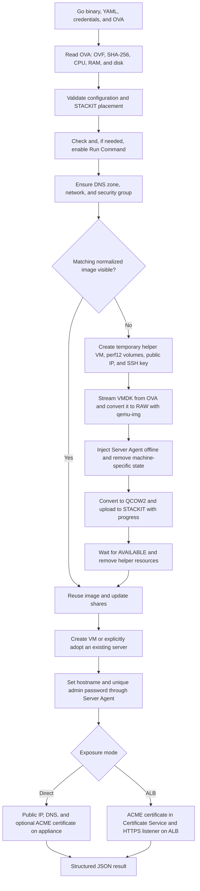
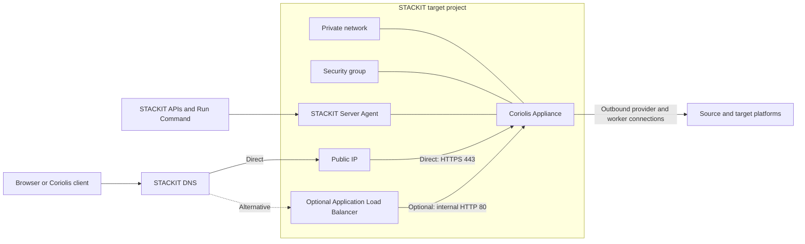

# Coriolis STACKIT Installer

**English** | [Deutsch](README.de.md)

The Coriolis STACKIT Installer deploys a Cloudbase Coriolis Appliance from an OVA
to a STACKIT project in a reproducible way. A single Go binary controls the entire
workflow. Terraform, the STACKIT CLI, a serial console, and manual Web Console
steps are not required.

A typical installation only needs:

- a STACKIT service account key;
- the target project ID;
- the desired STACKIT region;
- the Coriolis OVA;
- a YAML file containing project-specific settings.

Selected YAML values can be overridden with command-line flags. Repeated runs are
expected and supported: the installer discovers existing resources, resumes
interrupted image imports, and does not create a new VM on every run. Configuration
precedence is: built-in defaults, then YAML, then explicit CLI flags.

## Features

The installer can:

- read OVF metadata and calculate the OVA SHA-256 locally;
- validate the availability zone and machine type against OVA requirements;
- enable the project-wide STACKIT Run Command service when required;
- use a new or existing network;
- create a security group and add missing ingress rules;
- stream the VMDK to a temporary STACKIT helper VM without extracting it locally;
- convert and normalize the appliance on high-performance STACKIT volumes;
- inject the STACKIT Server Agent into the appliance filesystem offline;
- import a reusable QCOW2 image with progress reporting;
- find and reuse images automatically by OVA hash;
- share images with projects or the parent organization;
- use a central image project independently from target projects;
- create a new VM or explicitly adopt an existing server;
- assign an existing, free, or newly created public IP;
- create or update a STACKIT DNS zone and A record;
- generate an appliance-specific admin password or apply a supplied password;
- install a publicly trusted certificate directly on the appliance through ACME
  DNS-01;
- alternatively create a STACKIT Application Load Balancer with TLS termination;
- remove temporary helper resources after a successful image import.

This installer is not a Coriolis upgrade tool. A new OVA does not replace a
stateful server and does not migrate its license, projects, endpoints, or transfer
data. An existing server is never deleted automatically or replaced with a new
image.

## Workflow overview



The resulting runtime architecture is:



## Settings at a glance

| Area | High-level decision | Relevant settings |
|---|---|---|
| Target | Project and region | `project_id`, `region` |
| Image | Automatic discovery, explicit ID, or central image project | `image.id`, `image.owner_project_id` |
| Image sharing | None, individual projects, or entire organization | `image.share.*` |
| Compute | Availability zone, machine type, and boot disk | `server.*` |
| Performance | Appliance and normalization disk performance | `server.performance_class`, `normalization.performance_class` |
| Network | Existing network or automatically managed network | `network.id` or `network.name` |
| Firewall | Allowed ingress ports and source networks | `security_group.ingress` |
| Public IP | Automatic, existing ID/address, or none | `public_ip`, `public_ip_id`, `public_ip_address` |
| DNS | Discover/create zone and manage A record | `dns.*` |
| Login | Generate or supply the password | `bootstrap.*` |
| HTTPS | Direct appliance certificate or optional ALB | `exposure.*` |
| Runtime | Per-phase timeout, polling, and upload retries | `timeout`, `poll_interval`, `upload_attempts` |

## Typical durations

The following values are estimates for the current OVA with an approximately
7 GiB compressed VMDK, `storage_premium_perf12` normalization volumes, and a
stable internet connection. STACKIT load, local upload bandwidth, OVA size, and
storage class can change these values significantly.

| Step | Typical duration | Main influence |
|---|---:|---|
| Read OVA, parse OVF, and calculate SHA-256 | 30 seconds–3 minutes | Local disk performance |
| Check credentials, placement, and Run Command service | 30 seconds–3 minutes | Initial service activation |
| Ensure DNS zone, network, and security group | 1–4 minutes | Number of new resources |
| Start normalization volumes and helper VM | 3–10 minutes | VM/volume provisioning and agent startup |
| Transfer VMDK from OVA to helper VM | 8–30 minutes | Local upload; 7 GiB takes about 10 minutes at a net 100 Mbit/s |
| Convert VMDK to RAW | 3–15 minutes | OVA format and volume performance class |
| Normalize the appliance offline | 1–5 minutes | Filesystem checks and agent installation |
| Convert RAW to QCOW2 and upload | 8–30 minutes | Allocated data, CPU, and volume performance |
| Process STACKIT image until `AVAILABLE` | 3–15 minutes | Image service load |
| Boot appliance VM and wait for Server Agent | 3–10 minutes | Boot and initial agent registration |
| Configure password, public IP, DNS, and direct certificate | 2–10 minutes | DNS propagation and ACME |
| Provision optional ALB | additional 5–15 minutes | ALB and listener provisioning |

Typical totals are:

- first complete import with direct HTTPS: usually **40–100 minutes**;
- deployment using an existing normalized or shared image: usually **8–25 minutes**;
- idempotent rerun without material changes: usually **2–10 minutes**;
- ALB mode: approximately **5–15 additional minutes**.

The configured `timeout` is a technical upper limit for each major deployment
phase, not for the sum of the complete deployment. This prevents a long initial
image import from consuming the time budget needed later by server bootstrap or
certificate installation. Increase it to `120m` or `150m` if one individual phase,
such as image normalization, can exceed 90 minutes. The conversion steps can take
substantially longer with `storage_premium_perf1`; the estimates above assume
`perf12`.

### Progress output

Every deployment phase writes a status line to stderr:

```text
[START] Finding or creating Coriolis appliance server
[WAIT ] Finding or creating Coriolis appliance server (elapsed 40s)
[DONE ] Finding or creating Coriolis appliance server (elapsed 53s)
```

Long phases are split into explicit subphases. A completion line always refers only
to the matching start line; it does not mean that the complete deployment has
finished. For example, completing the byte upload is immediately followed by the
separate STACKIT control-plane import phase:

```text
[INFO ] Image data upload completed; STACKIT control-plane image processing follows
[DONE ] Converting normalized disk and uploading image data (elapsed 18m12s)
[START] Waiting for STACKIT image 8c405fdd-... to become AVAILABLE
[INFO ] Waiting for STACKIT image 8c405fdd-... to become AVAILABLE: current status CREATING (elapsed 1s)
[WAIT ] Waiting for STACKIT image 8c405fdd-... to become AVAILABLE: current status CREATING (elapsed 40s)
[DONE ] Waiting for STACKIT image 8c405fdd-... to become AVAILABLE (elapsed 20m3s)
```

When no other visible progress is produced, the currently active and most specific
subphase prints a heartbeat every 20 seconds. Resource polling also reports status
changes such as `CREATING`, `ATTACHED`, or `ACTIVE`. Failures use `[FAIL ]`; notices
and recoverable cleanup problems use `[INFO ]` and `[WARN ]`. Existing percentage
displays for VMDK transfer and image upload remain active and suppress redundant
heartbeat lines while data is moving. Only the final line
`[DONE ] Deploying Coriolis appliance` means that the complete deployment finished.

All progress goes to stderr, while the final machine-readable JSON result remains
on stdout. Sensitive bootstrap command output, including the appliance password,
is never streamed merely to provide progress; safe heartbeats remain visible while
that command runs.

## Documentation

| Chapter | Contents |
|---|---|
| [Technical prerequisites](docs/en/prerequisites.md) | Workstation, STACKIT permissions, quotas, connectivity, and OVA requirements |
| [Getting started](docs/en/getting-started.md) | Build, configure, validate, deploy, and repeat safely |
| [Architecture and workflow](docs/en/architecture.md) | Image discovery, helper normalization, bootstrap, DNS, certificates, and ALB |
| [Configuration reference](docs/en/configuration.md) | Complete YAML reference and CLI overrides |
| [Operations and scenarios](docs/en/operations.md) | Existing IPs, shared images, central image projects, adoption, and idempotency |
| [Network and security](docs/en/security.md) | Ingress rules, helper access, secret handling, limits, and safeguards |
| [Troubleshooting](docs/en/troubleshooting.md) | Common failures and recovery guidance |
| [Development](docs/en/development.md) | Repository layout, build, and test commands |

Start with [Technical prerequisites](docs/en/prerequisites.md), then follow the
[Getting started guide](docs/en/getting-started.md). For a complete configuration,
copy [examples/config.yaml](examples/config.yaml) and use the
[configuration reference](docs/en/configuration.md).
