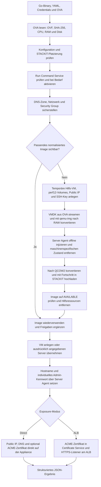
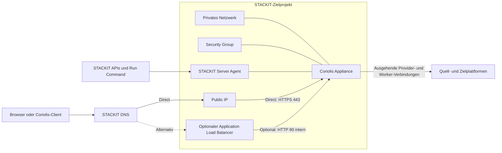

# Coriolis STACKIT Installer

Der Coriolis STACKIT Installer stellt eine Cloudbase Coriolis Appliance aus einer
OVA reproduzierbar in einem STACKIT-Projekt bereit. Der komplette Ablauf wird von
einem Go-Binary gesteuert. Terraform, die STACKIT CLI, eine serielle Konsole und
manuelle Schritte in der WebConsole sind nicht erforderlich.

Als Eingaben genügen im Normalfall:

- ein STACKIT Service-Account-Key,
- die ID des Zielprojekts,
- die gewünschte STACKIT-Region,
- das Coriolis-OVA,
- eine YAML-Datei für die projektspezifischen Einstellungen.

Kommandozeilenparameter können ausgewählte YAML-Werte überschreiben. Wiederholte
Aufrufe sind vorgesehen: Der Installer findet bereits angelegte Ressourcen wieder,
setzt unterbrochene Image-Importe fort und erzeugt nicht bei jedem Lauf eine neue VM.
Die Auflösungsreihenfolge lautet: eingebaute Defaults, danach YAML, danach explizite
CLI-Parameter.

## Funktionsumfang

Der Installer kann:

- OVF-Metadaten und SHA-256 des OVA lokal ermitteln;
- Availability Zone und Machine Type gegen die OVA-Anforderungen prüfen;
- den STACKIT Run-Command-Dienst bei Bedarf projektweit aktivieren;
- ein neues oder vorhandenes Netzwerk verwenden;
- eine Security Group anlegen und fehlende Ingress-Regeln ergänzen;
- die VMDK ohne lokale Extraktion auf eine temporäre STACKIT-Hilfs-VM streamen;
- die Appliance auf performanten STACKIT-Volumes konvertieren und normalisieren;
- den STACKIT Server Agent offline in das Appliance-Dateisystem integrieren;
- ein wiederverwendbares QCOW2-Image mit Fortschrittsanzeige importieren;
- Images automatisch anhand des OVA-Hashs finden und wiederverwenden;
- Images mit Projekten oder der Parent Organization teilen;
- ein zentrales Image-Projekt und davon getrennte Zielprojekte verwenden;
- eine neue VM erzeugen oder einen ausdrücklich angegebenen Server übernehmen;
- eine freie, neue oder ausdrücklich angegebene Public IP zuordnen;
- eine STACKIT-DNS-Zone sowie den A-Record anlegen oder aktualisieren;
- ein individuelles Admin-Kennwort generieren oder ein vorgegebenes setzen;
- ein öffentlich vertrauenswürdiges Zertifikat per ACME DNS-01 direkt in der
  Appliance installieren;
- alternativ einen STACKIT Application Load Balancer mit TLS-Terminierung anlegen;
- temporäre Hilfsressourcen nach einem erfolgreichen Image-Import entfernen.

Der Installer ist kein Coriolis-Upgrade-Werkzeug. Eine neue OVA ersetzt keinen
zustandsbehafteten Server und migriert weder Lizenz noch Projekte, Endpoints oder
Transferdaten. Ein bestehender Server wird niemals automatisch gelöscht oder durch
ein neues Image ersetzt.

## Ablaufübersicht



Das resultierende Laufzeitmodell sieht so aus:



## Einstellungen auf einen Blick

| Bereich | High-Level-Entscheidung | Typische Einstellung |
|---|---|---|
| Ziel | Projekt und Region | `project_id`, `region` |
| Image | Automatisch finden, explizite ID oder zentrales Image-Projekt | `image.id`, `image.owner_project_id` |
| Image-Freigabe | Keine, einzelne Projekte oder gesamte Organisation | `image.share.*` |
| Compute | Availability Zone, Machine Type und Boot-Disk | `server.*` |
| Performance | Performanceklasse der Appliance- und Normalisierungsdisks | `server.performance_class`, `normalization.performance_class` |
| Netzwerk | Vorhandenes Netzwerk oder automatisch angelegtes Netzwerk | `network.id` oder `network.name` |
| Firewall | Erlaubte eingehende Ports und Quellnetze | `security_group.ingress` |
| Public IP | Automatisch, vorhandene ID/Adresse oder keine | `public_ip`, `public_ip_id`, `public_ip_address` |
| DNS | Zone finden/anlegen und A-Record verwalten | `dns.*` |
| Login | Kennwort generieren oder vorgeben | `bootstrap.*` |
| HTTPS | Direktes Appliance-Zertifikat oder optionaler ALB | `exposure.*` |
| Laufzeit | Gesamt-Timeout, Polling und Upload-Wiederholungen | `timeout`, `poll_interval`, `upload_attempts` |

## Typische Laufzeiten

Die folgenden Werte sind Richtwerte für das derzeitige OVA mit ungefähr 7 GiB
komprimierter VMDK, Normalisierungsvolumes der Klasse `storage_premium_perf12` und
einer stabilen Internetverbindung. STACKIT-Auslastung, lokale Uploadbandbreite,
OVA-Größe und Storageklasse können die Zeiten deutlich verändern.

| Schritt | Typische Dauer | Wichtigster Einfluss |
|---|---:|---|
| OVA lesen, OVF auswerten und SHA-256 bilden | 30 Sekunden–3 Minuten | lokale Diskgeschwindigkeit |
| Credentials, Platzierung und Run Command Service prüfen/aktivieren | 30 Sekunden–3 Minuten | erstmalige Serviceaktivierung |
| DNS-Zone, Netzwerk und Security Group sicherstellen | 1–4 Minuten | Anzahl neu anzulegender Ressourcen |
| Normalisierungsvolumes und Hilfs-VM starten | 3–10 Minuten | VM-/Volume-Provisionierung und Agent-Start |
| VMDK aus dem OVA zur Hilfs-VM übertragen | 8–30 Minuten | lokale Uploadbandbreite; bei 7 GiB etwa 10 Minuten mit 100 Mbit/s netto |
| VMDK nach RAW konvertieren | 3–15 Minuten | OVA-Format und Volume-Performanceklasse |
| Appliance offline normalisieren | 1–5 Minuten | Dateisystemprüfung und Agent-Installation |
| RAW nach QCOW2 konvertieren und hochladen | 8–30 Minuten | Datenbelegung, CPU und Volume-Performanceklasse |
| STACKIT-Image bis `AVAILABLE` verarbeiten | 3–15 Minuten | Image-Service-Auslastung |
| Appliance-VM booten und Server Agent abwarten | 3–10 Minuten | Boot und erstmalige Agent-Registrierung |
| Kennwort, Public IP, DNS und direktes Zertifikat konfigurieren | 2–10 Minuten | DNS-Propagation und ACME |
| Optionalen ALB bereitstellen | zusätzlich 5–15 Minuten | ALB- und Listener-Provisionierung |

Damit ergeben sich folgende Größenordnungen:

- erster vollständiger Import mit direktem HTTPS: meistens **40–100 Minuten**;
- Deployment mit bereits normalisiertem oder geteiltem Image: meistens **8–25 Minuten**;
- idempotenter Folgelauf ohne wesentliche Änderungen: meistens **2–10 Minuten**;
- ALB-Modus: zusätzlich ungefähr **5–15 Minuten**.

Das konfigurierte `timeout` ist eine technische Obergrenze und keine Schätzung.
Bei langsamem Upload oder erstmaligem Import sollte es vorsorglich auf `120m` bis
`150m` erhöht werden. `storage_premium_perf1` kann insbesondere die beiden
Konvertierungsschritte stark verlängern; die Schätzungen basieren auf `perf12`.

## Technische Voraussetzungen

### Bedienrechner

Für die Ausführung werden benötigt:

- das für das Betriebssystem und die CPU-Architektur gebaute Installer-Binary;
- lesender Zugriff auf das OVA;
- ausgehendes HTTPS zu den STACKIT APIs und – bei aktiviertem Zertifikat – zum
  ACME-Dienst;
- beim erstmaligen Normalisieren eines OVA ausgehendes TCP/22 zur temporären
  Public IP der Hilfs-VM;
- ausreichend freier lokaler Speicher zum Lesen des OVA. Die VMDK wird nicht lokal
  extrahiert und es wird lokal kein QCOW2 erzeugt.

Zum Bauen aus dem Quellcode wird Go 1.25 oder neuer benötigt. `qemu-img`, Terraform,
libguestfs, `virt-customize` und die STACKIT CLI sind auf dem Bedienrechner nicht
erforderlich.

### STACKIT-Projekt und Berechtigungen

Der Installer aktiviert den projektweiten STACKIT Run Command Service standardmäßig
selbst, bevor er weitere Cloud-Ressourcen anlegt. Dafür benötigt der Service Account
die Rolle **Project Editor**. Mit `agent.enable_service: false` kann die Aktivierung
unterdrückt werden; dann muss der Dienst bereits aktiviert sein.

Zusätzlich benötigt der Service Account Lese- und Änderungsrechte für die Ressourcen,
die der gewählte Ablauf nutzt:

- IaaS: Images, Server, Volumes, Netzwerke, NICs, Security Groups, Public IPs und
  temporäre Keypairs;
- Server Agent / Run Command;
- STACKIT DNS, wenn `dns.enabled: true` gesetzt ist;
- Application Load Balancer und Certificate Service nur im ALB-Modus.

Bei einem zentralen Image-Projekt werden die IaaS- und Image-Freigaberechte sowohl
im Image-Eigentümerprojekt als auch im Zielprojekt benötigt. Beide Projekte müssen
zur selben Organisation gehören und das Image in derselben Region verwenden.

Die Datei mit dem Service-Account-Key sollte nur für den aktuellen Benutzer lesbar
sein:

```bash
chmod 600 credentials.json
```

### Quotas und ausgehende Verbindungen

Beim ersten Import werden vorübergehend eine Hilfs-VM, zwei Datenvolumes, eine
Public IP, eine Security Group und ein Keypair benötigt. Zusätzlich muss Quota für
das normalisierte Image, die Appliance-VM und deren Boot-Volume vorhanden sein.

Die Hilfs-VM benötigt ausgehenden Zugriff auf Ubuntu-Paketquellen, den STACKIT-
Metadatendienst und die Image-Upload-URL. Das Zielnetz muss für den Server Agent und
die späteren Coriolis-Verbindungen ausgehenden Verkehr erlauben.

### OVA-Anforderungen

Das OVA muss ein TAR-basiertes OVA mit genau einem OVF und genau einer referenzierten
virtuellen Disk enthalten. Der Installer liest CPU, RAM, Diskgröße, Betriebssystem
und Firmware aus dem OVF. Aktuell wird genau eine Appliance-Disk unterstützt.

## Schnellstart

### 1. Binary bauen

Dieser Schritt entfällt, wenn bereits ein passendes Binary vorliegt.

```bash
make check
```

Das Binary wird als `bin/coriolis-stackit` erzeugt. `make check` führt vorher die
Go-Tests aus.

### 2. Konfiguration anlegen

[`examples/config.yaml`](examples/config.yaml) enthält alle Einstellungen. Für ein
neues Projekt empfiehlt sich eine eigene Datei:

```bash
cp examples/config.yaml config.yaml
```

Ein minimales, für den direkten HTTPS-Zugriff geeignetes Beispiel:

```yaml
project_id: 00000000-0000-0000-0000-000000000000
credentials: credentials.json
ova: coriolis-appliance-stackit-0.ova
region: eu01

server:
  name: coriolis-appliance
  machine_type: c1a.4d
  availability_zone: eu01-m
  boot_volume_size_gib: 48
  performance_class: storage_premium_perf12

network:
  name: coriolis-network
  ipv4_prefix: 10.1.100.0/24
  routed: true

public_ip: true

dns:
  enabled: true
  create_zone: true
  zone_name: my-coriolis.runs.onstackit.cloud
  record_name: appliance
  ttl: 300

exposure:
  mode: direct
  certificate:
    enabled: true
    email: admin@example.com
    staging: false
    renew_before_days: 30

bootstrap:
  enabled: true
  admin_password: ""
  print_generated_password: true
```

`project_id` bestimmt nicht automatisch die Region. `region` sollte deshalb immer
bewusst gesetzt werden. Die IDs öffentlicher Helper-Images sind regionsabhängig.

### 3. Lokal prüfen

```bash
./bin/coriolis-stackit --config config.yaml --dry-run
```

`--dry-run` liest und validiert die Konfiguration, analysiert das OVA und gibt den
aufgelösten Plan als JSON aus. Es werden keine Cloud-Ressourcen verändert.

### 4. Cloud-Zugriff und Platzierung prüfen

```bash
./bin/coriolis-stackit --config config.yaml --check-cloud
```

Dieser Check authentifiziert sich, prüft Region, Availability Zone, Machine Type
und – soweit aktiviert – den DNS- beziehungsweise ALB-Zugriff. Er reserviert keine
Ressourcen und ersetzt keine vollständige Quota-Prüfung.

### 5. Deployment starten

```bash
./bin/coriolis-stackit --config config.yaml
```

Der erste Lauf kann wegen Upload, zwei Konvertierungen und Image-Import deutlich
länger dauern. Für den VMDK-Transfer sowie den Image-Upload wird regelmäßig ein
prozentualer Fortschritt mit Datenmenge und Übertragungsrate ausgegeben.

### 6. Ergebnis sicher speichern

Bei Erfolg schreibt das Programm ein JSON-Objekt nach stdout, beispielsweise:

```json
{
  "ProjectID": "00000000-0000-0000-0000-000000000000",
  "Region": "eu01",
  "ImageID": "...",
  "NetworkID": "...",
  "ServerID": "...",
  "SecurityGroupID": "...",
  "PublicIP": "192.0.2.10",
  "LoginURL": "https://appliance.my-coriolis.runs.onstackit.cloud",
  "LoginUser": "admin",
  "generated_password": "..."
}
```

Wenn `bootstrap.print_generated_password: true` gesetzt ist, enthält die Ausgabe
das generierte Kennwort. Die Ausgabe sollte dann direkt in einen geschützten Secret
Store übernommen und nicht in Build-Logs archiviert werden. Bei `false` wird das
Kennwort nicht ausgegeben.

### 7. Wiederholung testen

Der gleiche Befehl darf erneut ausgeführt werden:

```bash
./bin/coriolis-stackit --config config.yaml
```

Ein erfolgreicher Wiederholungslauf verwendet Image und Infrastruktur erneut. Bei
einem aktuellen direkten Zertifikat erscheint `appliance certificate is current`;
es findet dann weder eine neue ACME-Anforderung noch ein Container-Reconfigure statt.

## Detaillierter technischer Ablauf

### 1. OVA-Analyse und Vorabvalidierung

Der Installer berechnet den SHA-256 über das vollständige OVA und liest die OVF-
Metadaten. Er lehnt unter anderem zu kleine Boot- oder Scratch-Volumes, unbekannte
Availability Zones und Machine Types mit zu wenig CPU oder RAM vor dem Image-Upload
ab. Ohne explizite Availability Zone wird bevorzugt eine Zone mit dem Suffix `-m`
ausgewählt; ohne Machine Type wird der kleinste passende Typ gewählt.

### 2. Image-Suche und Wiederverwendung

Das OVA wird über das Label `coriolis-sha256` identifiziert. Wegen des STACKIT-
Label-Limits werden die ersten 32 Hex-Zeichen gespeichert. Ein verwendbares Image
trägt zusätzlich `coriolis-normalized=agent-v2`.

Die Suchreihenfolge ist:

1. lokales, verfügbares Image im Zielprojekt;
2. für das Zielprojekt sichtbares, geteiltes Image;
3. ein noch laufender eigener Image-Import;
4. Suche beziehungsweise Import im konfigurierten Image-Eigentümerprojekt.

Ein explizites `image.id` umgeht die automatische Auswahl, muss bei aktiviertem
Agent-Ablauf aber ebenfalls als `agent-v2` normalisiert sein. Ein `CREATING`-Import
wird beobachtet; ein eigener, seit mehr als 30 Minuten unveränderter Import wird als
stale entfernt und neu erzeugt.

### 3. Normalisierung auf der Hilfs-VM

Nur wenn kein geeignetes Image existiert, legt der Installer temporäre Ressourcen an:

- eine Ubuntu-Hilfs-VM mit Server Agent;
- ein Quellvolume in Größe der späteren Boot-Disk;
- ein Scratchvolume für eingehende VMDK und ausgehende QCOW2-Datei;
- eine temporäre Public IP, Security Group und ein einmaliges Ed25519-Keypair.

Der SSH-Hostkey der Hilfs-VM wird zuerst über den unabhängigen STACKIT Server Agent
ausgelesen. Der anschließende Go-SSH-Transfer akzeptiert ausschließlich diesen
gepinnten Hostkey. Ein abgebrochener VMDK-Transfer wird anhand der bereits übertragenen
Bytezahl fortgesetzt.

Auf der Hilfs-VM geschieht anschließend:

1. Installation von `qemu-utils`;
2. VMDK → RAW direkt auf das performante Quellvolume;
3. schreibbares Einhängen der Appliance-Rootpartition;
4. Offline-Installation und Aktivierung des STACKIT Server Agent;
5. Entfernen ausschließlich maschinenspezifischer Agent- und Cloud-init-Zustände;
6. RAW → QCOW2 auf das Scratchvolume;
7. Prüfung des QCOW2 und Upload über die STACKIT-Image-Upload-URL;
8. Warten auf den Image-Status `AVAILABLE`.

Das Original-OVA bleibt unverändert. Coriolis-Konfiguration, Support-SSH und
Appliance-Anwendungsdaten werden bei der Normalisierung nicht verändert.

Nach erfolgreichem Import werden die Hilfs-VM, die beiden Volumes, die temporäre
Public IP, Security Group und das Keypair entfernt. Bei einem frühen Fehler bleiben
gelabelte Volumes gegebenenfalls für Diagnose und Wiederaufnahme erhalten. Ein
Folgelauf erkennt sie und bereinigt veraltete Hilfszugänge.

### 4. Server, Netzwerk und Storage

Netzwerk und Security Group werden anhand ihrer Namen wiederverwendet, sofern keine
Netzwerk-ID vorgegeben wurde. Die Appliance-VM wird anhand von `server.id` oder
`server.name` gefunden. Eine neue VM erhält das normalisierte Image als Bootquelle,
die konfigurierte Performanceklasse und den Server Agent.

Für die Appliance sowie die Normalisierungsvolumes ist
`storage_premium_perf12` der empfohlene Default. Konvertierung, Image-Upload,
Migrationen und Backups erzeugen anhaltende I/O-Last; `perf1` ist für diese Datenpfade
häufig zu langsam. Nur die kleine Betriebssystemdisk der Hilfs-VM verwendet fest
`storage_premium_perf1`, weil die Nutzdaten auf den separaten perf12-Volumes liegen.

### 5. Appliance-Bootstrap

Nach dem Boot wartet der Installer auf den STACKIT Server Agent und führt den
Bootstrap über Run Command im Basisbetriebssystem aus. Der Coriolis-Support-SSH-
Dienst, dessen Accounts und dessen Konfiguration werden nicht verändert.

Der Bootstrap:

- setzt den Hostnamen;
- wartet auf Keystone;
- setzt das Kennwort des Coriolis-Administrators `admin`;
- aktualisiert die lokale OpenRC-Datei;
- führt die herstellereigene Exposure-Logik aus;
- speichert Kennwort und Idempotenzmarker unter `/var/lib/coriolis-stackit` mit
  Root-only-Berechtigungen.

Ist `bootstrap.admin_password` leer, wird einmalig ein zufälliges, Appliance-
spezifisches Kennwort erzeugt. Wiederholungen liefern dasselbe Kennwort zurück.

### 6. Public IP und DNS

Im Direct-Modus verwendet der Installer in dieser Reihenfolge:

1. eine bereits an der Appliance-NIC vorhandene Public IP;
2. die über `public_ip_id` oder `public_ip_address` verlangte freie IP;
3. eine freie, vom Installer verwaltete Public IP;
4. eine neu reservierte Public IP.

Eine verlangte IP, die an eine andere NIC gebunden ist, führt zum sicheren Abbruch.
Der A-Record wird angelegt oder auf die aktuelle Adresse aktualisiert. Eine DNS-Zone
kann über ID oder Namen ausgewählt und bei `create_zone: true` automatisch erzeugt
werden.

### 7. Öffentlich vertrauenswürdiges Zertifikat

Im empfohlenen Direct-Modus erzeugt die Appliance selbst einen RSA-Schlüssel und
einen CSR für den FQDN. Der private Schlüssel verlässt die VM nie. Das Go-Programm
führt die ACME-DNS-01-Challenge über STACKIT DNS aus und überträgt nur Leaf- und
Issuer-Zertifikate zurück auf die Appliance.

Vor der Aktivierung werden Hostname, Restlaufzeit, Key-Paar und vollständige Chain
geprüft. Der Installer sichert die aktiven Herstellerdateien, installiert die neue
Kette und ruft `expose_coriolis.py` mit der privaten Interface-IP auf. Anschließend
werden ausschließlich `coriolis-web-proxy` und `coriolis-api` neu geladen. Die
tatsächlich auf 443 und 5000 ausgelieferten Leaf-Fingerprints müssen mit der aktiven
Datei übereinstimmen. Bei einem Fehler wird auf die gesicherten Dateien und den
vorherigen Hostnamen zurückgerollt.

Ein gültiges Zertifikat wird wiederverwendet. Auch wenn die Datei bereits korrekt,
der Dienst aber noch nicht neu geladen ist, wird das vorhandene Key-Paar genutzt;
es wird dafür kein unnötiges neues Zertifikat angefordert.

### 8. Optionaler Application Load Balancer

Mit `exposure.mode: application_load_balancer` terminiert ein STACKIT ALB HTTPS auf
Port 443. Das Zertifikat wird per DNS-01 ausgestellt und im STACKIT Certificate
Service gespeichert. Der ALB leitet standardmäßig unverschlüsselt auf Port 80 der
privaten Appliance-IP weiter.

Der ALB ist optional. Für den Standardfall wird das Zertifikat direkt in der
Appliance installiert, damit Weboberfläche und Coriolis-Dienste möglichst nah am
Herstellerprodukt bleiben. Der ALB betrifft nur den konfigurierten Layer-7-Webpfad;
Migrations- und Worker-Verbindungen werden nicht automatisch durch ihn geführt.

## Vollständige YAML-Referenz

### Allgemein

| Schlüssel | Bedeutung | Default |
|---|---|---|
| `project_id` | STACKIT-Zielprojekt | erforderlich |
| `credentials` | Pfad zum Service-Account-Key | erforderlich |
| `ova` | Pfad zur Coriolis-OVA | erforderlich |
| `region` | STACKIT-Region | `eu01` |
| `timeout` | Maximale Gesamtlaufzeit | `90m` |
| `poll_interval` | Pollingintervall für asynchrone Ressourcen | `15s` |
| `upload_attempts` | Transferwiederholungen | `3` |

Bei sehr großen Images oder langsamer Anbindung sollte `timeout` erhöht werden.

### `agent` und `bootstrap`

| Schlüssel | Bedeutung | Default |
|---|---|---|
| `agent.enabled` | Server-Agent-Management aktivieren | `true` |
| `agent.enable_service` | Run Command Service im Projekt bei Bedarf automatisch aktivieren | `true` |
| `bootstrap.enabled` | Hostname und Admin-Kennwort konfigurieren | `true` |
| `bootstrap.admin_password` | Festes Admin-Kennwort; leer erzeugt ein zufälliges | leer |
| `bootstrap.print_generated_password` | Generiertes Kennwort im Ergebnis ausgeben | `true` |

Für die vollständige Automatisierung müssen Agent und Bootstrap aktiviert bleiben.
Zur automatischen Einrichtung neuer Projekte muss außerdem `agent.enable_service`
aktiviert bleiben und der Service Account die Rolle `Project Editor` besitzen.
Ein festes Kennwort in YAML liegt dort im Klartext; die Datei muss entsprechend
geschützt werden. Für Kommandozeilenwerte gilt zusätzlich das Risiko der Shell-History.

### `normalization`

| Schlüssel | Bedeutung | Default |
|---|---|---|
| `performance_class` | Performanceklasse für Quell- und Scratchvolume | `storage_premium_perf12` |
| `scratch_size_gib` | Größe des Scratchvolumes | `64` |
| `helper_image_id` | Öffentliches Ubuntu-Image der Hilfs-VM | regionsabhängige ID im Beispiel |
| `helper_machine_type` | Machine Type der Hilfs-VM | `g1a.1d` |
| `helper_boot_size_gib` | Boot-Disk der Hilfs-VM | `16` |

Das Scratchvolume muss mindestens die virtuelle Diskgröße plus die komprimierte
VMDK-Größe und 2 GiB Reserve aufnehmen. Der Installer prüft dies vor Cloud-Änderungen.

### `image`

| Schlüssel | Bedeutung | Default |
|---|---|---|
| `id` | Explizite vorhandene Image-ID | leer |
| `owner_project_id` | Zentrales Image-Eigentümerprojekt | Zielprojekt |
| `name_prefix` | Präfix neuer Images | `coriolis-appliance` |
| `disk_bus` | Virtueller Disk-Bus | `virtio` |
| `nic_model` | Virtuelles NIC-Modell | `virtio` |
| `uefi` | UEFI aktivieren | `false` |
| `secure_boot` | Secure Boot aktivieren | `false` |
| `share.parent_organization` | Mit gesamter Parent Organization teilen | `false` |
| `share.project_ids` | Liste expliziter Consumer-Projekte | `[]` |

`parent_organization` und `project_ids` schließen sich gegenseitig aus.

### `server`

| Schlüssel | Bedeutung | Default |
|---|---|---|
| `id` | Vorhandenen Server ausdrücklich übernehmen | leer |
| `name` | Name der Appliance und Suchschlüssel | `coriolis-appliance` |
| `machine_type` | Gewünschter Machine Type | `c1a.4d` |
| `availability_zone` | Gewünschte Availability Zone | automatisch, im Beispiel `eu01-m` |
| `boot_volume_size_gib` | Größe des Boot-Volumes | `48` |
| `performance_class` | Performanceklasse des Boot-Volumes | `storage_premium_perf12` |
| `keypair_name` | Optionales vorhandenes Keypair | leer |
| `delete_boot_volume_on_termination` | Boot-Volume beim Löschen der VM löschen | `false` |

Die Boot-Disk darf nicht kleiner als die im OVF deklarierte Disk sein. Ein Keypair
aktiviert nicht automatisch den Coriolis-Support-SSH-Dienst.

### `network` und `security_group`

| Schlüssel | Bedeutung | Default |
|---|---|---|
| `network.id` | Vorhandenes Netzwerk verbindlich verwenden | leer |
| `network.name` | Netzwerk suchen oder neu anlegen | `coriolis-network` |
| `network.ipv4_prefix` | Prefix eines neu angelegten Netzwerks | `10.1.100.0/24` |
| `network.routed` | Geroutetes Netzwerk anlegen | `true` |
| `security_group.name` | Security-Group-Name | `coriolis-security` |
| `security_group.ingress[]` | Gewünschte Ingress-Regeln | TCP/443 aus dem Beispiel-CIDR |

Eine Ingress-Regel enthält `protocol`, `port`, `cidr` und eine eindeutige
`description`. Fehlende Regeln werden ergänzt; vorhandene Regeln werden nicht
automatisch entfernt. Für produktive Installationen sollte TCP/443 auf bekannte
Administrator-, Proxy- oder VPN-Netze begrenzt werden, sofern kein öffentlicher
Zugriff benötigt wird.

### Public IP und DNS

| Schlüssel | Bedeutung | Default |
|---|---|---|
| `public_ip` | Public IP im Direct-Modus sicherstellen | `true` |
| `public_ip_id` | Bestimmte reservierte Public IP per ID verwenden | leer |
| `public_ip_address` | Bestimmte reservierte Public IP per Adresse verwenden | leer |
| `dns.enabled` | DNS verwalten | `false` im Code, im Beispiel aktiviert |
| `dns.create_zone` | Fehlende Zone anlegen | `false` |
| `dns.zone_id` | Vorhandene Zone per ID | leer |
| `dns.zone_name` | Zonenname oder DNS-Name | erforderlich, wenn keine ID gesetzt ist |
| `dns.record_name` | Hostname oder vollständiger FQDN | erforderlich bei aktiviertem DNS |
| `dns.ttl` | TTL des A-Records | `300` |

Ein direkt installiertes Zertifikat benötigt DNS und eine Public IP. Im ALB-Modus
zeigt der A-Record auf die externe Adresse des Load Balancers.

### `exposure`

| Schlüssel | Bedeutung | Default |
|---|---|---|
| `mode` | `direct` oder `application_load_balancer` | `direct` |
| `certificate.enabled` | Zertifikat direkt in der Appliance verwalten | `false` |
| `certificate.email` | ACME-Kontaktadresse | erforderlich bei Zertifikatsnutzung |
| `certificate.staging` | Let's-Encrypt-Staging verwenden | `false` |
| `certificate.renew_before_days` | Erneuerungsfenster | `30` |
| `certificate.name_prefix` | Präfix im Certificate Service, nur ALB | `coriolis-tls` |
| `load_balancer.name` | Name des ALB | `coriolis-alb` |
| `load_balancer.plan_id` | STACKIT-ALB-Plan | `p10` |
| `load_balancer.backend_port` | Port der Appliance | `80` |
| `load_balancer.health_check_path` | HTTP-Health-Check-Pfad | `/` |

Für erste ACME-Tests sollte `certificate.staging: true` verwendet werden. Erst nach
einem erfolgreichen Ablauf sollte auf die produktive CA umgestellt werden, um
Rate-Limits zu vermeiden.

## CLI-Überschreibungen

CLI-Parameter überschreiben die entsprechenden YAML-Werte:

| Parameter | YAML-Ziel |
|---|---|
| `--project-id` | `project_id` |
| `--credentials` | `credentials` |
| `--ova` | `ova` |
| `--region` | `region` |
| `--image-id` | `image.id` |
| `--image-owner-project-id` | `image.owner_project_id` |
| `--share-image-with-organization` | `image.share.parent_organization: true` |
| `--share-image-with-projects` | `image.share.project_ids`, kommasepariert |
| `--server-id` | `server.id` |
| `--availability-zone` | `server.availability_zone` |
| `--machine-type` | `server.machine_type` |
| `--performance-class` | `server.performance_class` |
| `--boot-volume-size` | `server.boot_volume_size_gib` |
| `--normalization-performance-class` | `normalization.performance_class` |
| `--normalization-scratch-size` | `normalization.scratch_size_gib` |
| `--normalization-helper-image-id` | `normalization.helper_image_id` |
| `--normalization-helper-machine-type` | `normalization.helper_machine_type` |
| `--normalization-helper-boot-size` | `normalization.helper_boot_size_gib` |
| `--network-id` | `network.id` |
| `--public-ip-id` | `public_ip_id`, aktiviert zugleich `public_ip` |
| `--public-ip-address` | `public_ip_address`, aktiviert zugleich `public_ip` |
| `--dns-zone-id` | `dns.zone_id` |
| `--dns-zone-name` | `dns.zone_name` |
| `--dns-name` | `dns.record_name`, aktiviert zugleich DNS |
| `--certificate-email` | `exposure.certificate.email`, aktiviert im Direct-Modus das Zertifikat |
| `--admin-password` | `bootstrap.admin_password`, aktiviert zugleich Bootstrap |
| `--enable-run-command-service` | `agent.enable_service=true` |
| `--disable-run-command-service-activation` | `agent.enable_service=false` |
| `--dry-run` | Nur lokale Validierung und Plan-Ausgabe |
| `--check-cloud` | Read-only-Cloud-Prüfung |
| `--version` | Build-Version ausgeben |

Beispiel ohne YAML für die drei Pflichtwerte:

```bash
./bin/coriolis-stackit \
  --credentials credentials.json \
  --project-id 00000000-0000-0000-0000-000000000000 \
  --ova coriolis-appliance-stackit-0.ova
```

Für alle weiteren Werte gelten die Defaults. Für reproduzierbare Installationen wird
eine versionierte YAML-Datei ohne Secrets empfohlen.

## Typische Nutzungsszenarien

### Vorhandene Public IP verwenden

Per ID:

```yaml
public_ip: true
public_ip_id: 00000000-0000-0000-0000-000000000000
```

Oder per Adresse:

```yaml
public_ip: true
public_ip_address: 192.0.2.10
```

### Zentrales Image-Projekt

```yaml
image:
  owner_project_id: 11111111-1111-1111-1111-111111111111
  share:
    project_ids:
      - 22222222-2222-2222-2222-222222222222
```

Fehlt das Image, normalisiert der Installer das OVA im Eigentümerprojekt. Das
aktuelle Zielprojekt wird automatisch als Consumer ergänzt, sofern nicht mit der
gesamten Parent Organization geteilt wird.

Organisationsweite Freigabe:

```yaml
image:
  owner_project_id: 11111111-1111-1111-1111-111111111111
  share:
    parent_organization: true
```

### Vorhandenes normalisiertes Image explizit verwenden

```yaml
image:
  id: 33333333-3333-3333-3333-333333333333
```

Die OVA bleibt trotzdem erforderlich, weil ihr Hash und ihre Hardwareanforderungen
für Validierung und Zuordnung verwendet werden.

### Bestehenden Server übernehmen

```yaml
server:
  id: 44444444-4444-4444-4444-444444444444
  name: coriolis-appliance
```

Der Installer ersetzt das Boot-Volume nicht und verändert weder Appliance-ID noch
Coriolis-Daten oder Lizenz. Er verlangt aber, dass der Server am konfigurierten
Netzwerk hängt, und ergänzt die Security Group bei Bedarf.

Wichtig: Aktivierter Bootstrap oder Zertifikatsbetrieb verändert anschließend
Hostname, Admin-Kennwort beziehungsweise TLS-Konfiguration des übernommenen Servers.
Vor der erstmaligen Übernahme einer produktiven, lizenzierten Appliance ist deshalb
ein Volume-Backup erforderlich. Für Agent-gesteuerte Schritte muss auf dem bestehenden
Server bereits ein funktionsfähiger STACKIT Server Agent vorhanden sein.

### Optionaler ALB

```yaml
dns:
  enabled: true
  create_zone: true
  zone_name: my-coriolis.runs.onstackit.cloud
  record_name: appliance

exposure:
  mode: application_load_balancer
  certificate:
    email: admin@example.com
    staging: false
    renew_before_days: 30
    name_prefix: coriolis-tls
  load_balancer:
    name: coriolis-alb
    plan_id: p10
    backend_port: 80
    health_check_path: /
```

## Idempotenz und Verhalten bei Fehlern

Der Installer verwendet keine lokale State-Datei. Er erkennt Ressourcen über IDs,
Namen, Beziehungen und Labels wie `managed-by`, `coriolis-sha256` und
`coriolis-normalized`.

| Situation | Verhalten |
|---|---|
| Image ist bereits verfügbar | Wiederverwenden |
| Eigenes Image ist noch `CREATING` | Bis zum Endstatus beobachten |
| Image-Import ist erkennbar stale | Alten Import entfernen und neu starten |
| VMDK-Transfer wurde unterbrochen | Ab der vorhandenen Byteposition fortsetzen |
| Normalisierte Volumes sind vorhanden | Für die Fortsetzung wiederverwenden |
| Servername existiert mit anderem Image-Label | Abbruch, kein impliziter Ersatz |
| Server ist `ERROR` oder `DELETED` | Abbruch, keine automatische Löschung |
| Public IP ist bereits an der richtigen NIC | Wiederverwenden |
| Verlangte Public IP hängt an anderer NIC | Abbruch |
| DNS-A-Record existiert | Auf gewünschte IP aktualisieren |
| Admin-Kennwort wurde bereits generiert | Dasselbe Appliance-Kennwort wiederverwenden |
| Zertifikat und laufender Dienst sind aktuell | Keine ACME- oder Reconfigure-Aktion |
| Zertifikatseinbau scheitert | Herstellerdateien und Hostname zurückrollen |
| Run Command liefert vorübergehenden API-Fehler | Polling beziehungsweise Bootstrap begrenzt wiederholen |

Bestehende Netzwerke werden nach Namen wiederverwendet; Prefix und Routing eines
bereits vorhandenen Netzwerks werden nicht automatisch geändert. Security-Group-
Regeln werden ergänzt, aber nicht entfernt. Eine Änderung dieser Parameter sollte
daher bewusst mit neuen Ressourcennamen oder administrativ vorbereitet werden.

## Netzwerk- und Sicherheitsmodell

### Dauerhafte Ingress-Regeln

Standardmäßig öffnet die Appliance-Security-Group nur TCP/443. SSH wird bewusst
nicht geöffnet oder umkonfiguriert. Der Coriolis-Support kann seinen vorgesehenen
SSH-Dienst weiterhin wie vom Hersteller vorgesehen aktivieren und verwenden.

Der STACKIT Server Agent benötigt keine Ingress-Regel; er nutzt einen separaten,
ausgehenden Managementkanal.

Für Migrationen baut die Appliance die Verbindungen zu Quell- und Ziel-APIs sowie
temporären Workern überwiegend ausgehend auf. Abhängig vom Provider können unter
anderem TCP/22, 4433, 5566 und 5986 relevant sein. Remote-Zugriffe auf Coriolis APIs
oder externe Worker können zusätzliche, eng begrenzte Ingress-Regeln erfordern. Die
maßgebliche Referenz ist die
[Coriolis Port Matrix](https://cloudbase.it/coriolis-network-ports-requirements/).

### Temporärer SSH-Zugang der Hilfs-VM

Nur während eines neuen OVA-Imports erzeugt der Installer eine separate Security
Group für TCP/22 zur Hilfs-VM. Die aktuelle Implementierung erlaubt dort temporär
`0.0.0.0/0`. Der Zugriff ist ausschließlich mit einem zufälligen Einmal-Key möglich,
und der Hostkey wird über den Server Agent gepinnt. Nach erfolgreichem Import werden
Public IP, Keypair und Security Group entfernt. Nach einem Fehler sollte der
Folgelauf zeitnah gestartet oder die gelabelte Hilfsinfrastruktur kontrolliert
bereinigt werden.

Dieser temporäre SSH-Kanal gehört nur zur Image-Erstellung. Er verändert und nutzt
nicht den Support-SSH-Dienst der Coriolis-Appliance.

### Umgang mit Secrets

- Der Service-Account-Key wird nur zur SDK-Authentifizierung gelesen.
- Credentials werden nicht in die Ergebnisstruktur aufgenommen.
- Das generierte Admin-Kennwort liegt in der Appliance root-only.
- Run-Command-Ausgaben mit dem Admin-Kennwort werden nicht live gestreamt.
- Beim direkten Zertifikat bleibt der TLS-Private-Key auf der Appliance.
- Hersteller-Reconfigure-Logs werden nicht nach außen gestreamt und nach Abschluss
  beziehungsweise Rollback entfernt.
- Ein per `--admin-password` übergebenes Kennwort kann in der Shell-History landen.

## Grenzen und bewusste Schutzmechanismen

- Genau eine Disk pro OVA wird unterstützt.
- Eine neue OVA führt zu einem neuen Image, aber niemals zum automatischen Austausch
  einer bestehenden VM.
- Es gibt keinen automatischen Daten-, Lizenz- oder Coriolis-Upgrade-Workflow.
- Ein vorhandener Server mit abweichendem Netzwerk wird nicht automatisch umgehängt.
- Eine fehlerhafte VM wird nicht automatisch gelöscht.
- Das Tool entfernt keine bestehenden Security-Group-Regeln.
- Der optionale ALB deckt nur seinen HTTPS-Webpfad ab, nicht sämtliche Coriolis-
  Migrationsverbindungen.
- Änderungen an einem vorhandenen ALB sollten nach dem Deployment separat geprüft
  werden; die Wiederverwendung orientiert sich primär an Name und Zertifikat.

Diese Grenzen verhindern, dass ein Wiederholungslauf unbeabsichtigt eine lizenzierte
oder bereits konfigurierte Appliance ersetzt.

## Fehleranalyse

Empfohlene Reihenfolge:

1. `--dry-run` ausführen und OVA-/Größenfehler beheben.
2. `--check-cloud` für Berechtigungen, Region, Zone und Machine Type ausführen.
3. Quota für Server, Images, Volumes und Public IPs prüfen.
4. Bei `Service not enabled` sicherstellen, dass `agent.enable_service: true` gesetzt
   ist und der Service Account die Rolle `Project Editor` besitzt.
5. Bei einem Transferfehler denselben Installerbefehl erneut ausführen.
6. Bei DNS-/ACME-Fehlern Zone, Recordname und Service-Account-Rechte prüfen.
7. Bei einem übernommenen Server prüfen, ob der STACKIT Server Agent aktiv ist.
8. Keine VM oder Normalisierungsvolumes blind löschen: gelabelte Ressourcen können
   einen fortsetzbaren Zwischenstand enthalten.

Der Installer gibt Fehler mit der betroffenen Phase zurück. Beim Zertifikatseinbau
werden nur bereinigte Fehlerkategorien ausgegeben; interne Hersteller-Secrets werden
nicht in das Konsolenlog übernommen.

## Entwicklung

### Projektstruktur

```text
.
├── cmd/
│   └── coriolis-stackit/
│       └── main.go            # schlanker Programmeinstieg
├── internal/
│   └── installer/             # Deploymentlogik und Unit-Tests
├── examples/
│   └── config.yaml            # vollständige, secret-freie Beispielkonfiguration
├── Makefile
├── README.md
├── go.mod
└── go.sum
```

`internal/installer` ist absichtlich ein gemeinsames internes Paket: Die Phasen
teilen Konfiguration, Cloud-Client und Zustandsmodell und bilden keine öffentliche
Go-Bibliothek. Projektspezifische YAML-Dateien, Credentials, OVAs, Wartungsdaten und
gebaute Binaries bleiben durch `.gitignore` ausschließlich lokal.

### Bauen und testen

```bash
go test ./...
go vet ./...
go build -trimpath -o bin/coriolis-stackit ./cmd/coriolis-stackit
```

Oder über das Makefile:

```bash
make test
make build
make check
```

Die Cloud-Operationen verwenden die offiziellen STACKIT Go SDKs für IaaS, Run
Command, DNS, ALB und Certificates. Projektgebundene Diagnose- und
Integrationstests gehören nicht zum veröffentlichten Quellbestand; sie dürfen nur
lokal und gegen disposable Testsysteme ausgeführt werden.
