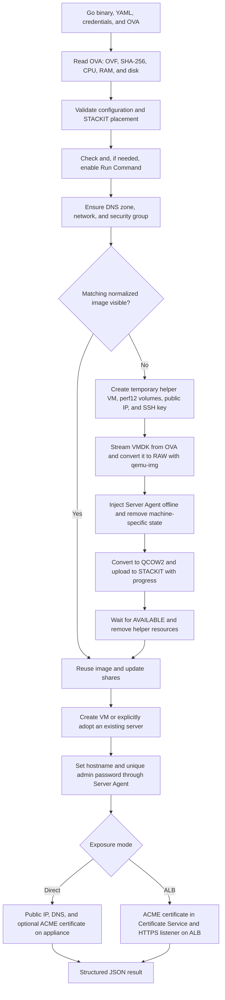
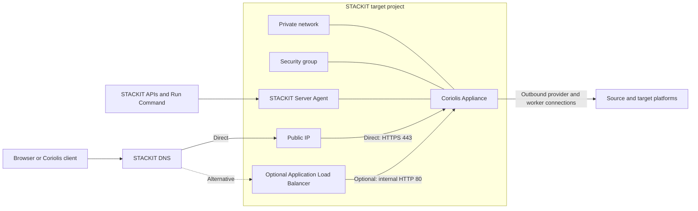

# Coriolis STACKIT Installer

**English** | [Deutsch](README.de.md)

The Coriolis STACKIT Installer deploys a Cloudbase Coriolis Appliance from an OVA
to a STACKIT project in a reproducible way. A single Go binary controls the entire
workflow. Terraform, the STACKIT CLI, a serial console, and manual Web Console
steps are not required.

A typical installation only needs:

- a STACKIT service account key;
- the target project ID;
- the desired STACKIT region;
- the Coriolis OVA;
- a YAML file containing project-specific settings.

Selected YAML values can be overridden with command-line flags. Repeated runs are
expected and supported: the installer discovers existing resources, resumes
interrupted image imports, and does not create a new VM on every run. Configuration
precedence is: built-in defaults, then YAML, then explicit CLI flags.

## Features

The installer can:

- read OVF metadata and calculate the OVA SHA-256 locally;
- validate the availability zone and machine type against OVA requirements;
- enable the project-wide STACKIT Run Command service when required;
- use a new or existing network;
- create a security group and add missing ingress rules;
- stream the VMDK to a temporary STACKIT helper VM without extracting it locally;
- convert and normalize the appliance on high-performance STACKIT volumes;
- inject the STACKIT Server Agent into the appliance filesystem offline;
- import a reusable QCOW2 image with progress reporting;
- find and reuse images automatically by OVA hash;
- share images with projects or the parent organization;
- use a central image project independently from target projects;
- create a new VM or explicitly adopt an existing server;
- assign an existing, free, or newly created public IP;
- create or update a STACKIT DNS zone and A record;
- generate an appliance-specific admin password or apply a supplied password;
- install a publicly trusted certificate directly on the appliance through ACME
  DNS-01;
- alternatively create a STACKIT Application Load Balancer with TLS termination;
- remove temporary helper resources after a successful image import.

This installer is not a Coriolis upgrade tool. A new OVA does not replace a
stateful server and does not migrate its license, projects, endpoints, or transfer
data. An existing server is never deleted automatically or replaced with a new
image.

## Workflow overview



The resulting runtime architecture is:



## Settings at a glance

| Area | High-level decision | Relevant settings |
|---|---|---|
| Target | Project and region | `project_id`, `region` |
| Image | Automatic discovery, explicit ID, or central image project | `image.id`, `image.owner_project_id` |
| Image sharing | None, individual projects, or entire organization | `image.share.*` |
| Compute | Availability zone, machine type, and boot disk | `server.*` |
| Performance | Appliance and normalization disk performance | `server.performance_class`, `normalization.performance_class` |
| Network | Existing network or automatically managed network | `network.id` or `network.name` |
| Firewall | Allowed ingress ports and source networks | `security_group.ingress` |
| Public IP | Automatic, existing ID/address, or none | `public_ip`, `public_ip_id`, `public_ip_address` |
| DNS | Discover/create zone and manage A record | `dns.*` |
| Login | Generate or supply the password | `bootstrap.*` |
| HTTPS | Direct appliance certificate or optional ALB | `exposure.*` |
| Runtime | Per-phase timeout, polling, and upload retries | `timeout`, `poll_interval`, `upload_attempts` |

## Typical durations

The following values are estimates for the current OVA with an approximately
7 GiB compressed VMDK, `storage_premium_perf12` normalization volumes, and a
stable internet connection. STACKIT load, local upload bandwidth, OVA size, and
storage class can change these values significantly.

| Step | Typical duration | Main influence |
|---|---:|---|
| Read OVA, parse OVF, and calculate SHA-256 | 30 seconds–3 minutes | Local disk performance |
| Check credentials, placement, and Run Command service | 30 seconds–3 minutes | Initial service activation |
| Ensure DNS zone, network, and security group | 1–4 minutes | Number of new resources |
| Start normalization volumes and helper VM | 3–10 minutes | VM/volume provisioning and agent startup |
| Transfer VMDK from OVA to helper VM | 8–30 minutes | Local upload; 7 GiB takes about 10 minutes at a net 100 Mbit/s |
| Convert VMDK to RAW | 3–15 minutes | OVA format and volume performance class |
| Normalize the appliance offline | 1–5 minutes | Filesystem checks and agent installation |
| Convert RAW to QCOW2 and upload | 8–30 minutes | Allocated data, CPU, and volume performance |
| Process STACKIT image until `AVAILABLE` | 3–15 minutes | Image service load |
| Boot appliance VM and wait for Server Agent | 3–10 minutes | Boot and initial agent registration |
| Configure password, public IP, DNS, and direct certificate | 2–10 minutes | DNS propagation and ACME |
| Provision optional ALB | additional 5–15 minutes | ALB and listener provisioning |

Typical totals are:

- first complete import with direct HTTPS: usually **40–100 minutes**;
- deployment using an existing normalized or shared image: usually **8–25 minutes**;
- idempotent rerun without material changes: usually **2–10 minutes**;
- ALB mode: approximately **5–15 additional minutes**.

The configured `timeout` is a technical upper limit for each major deployment
phase, not for the sum of the complete deployment. This prevents a long initial
image import from consuming the time budget needed later by server bootstrap or
certificate installation. Increase it to `120m` or `150m` if one individual phase,
such as image normalization, can exceed 90 minutes. The conversion steps can take
substantially longer with `storage_premium_perf1`; the estimates above assume
`perf12`.

### Progress output

Every deployment phase writes a status line to stderr:

```text
[START] Finding or creating Coriolis appliance server
[WAIT ] Finding or creating Coriolis appliance server (elapsed 40s)
[DONE ] Finding or creating Coriolis appliance server (elapsed 53s)
```

Long phases are split into explicit subphases. A completion line always refers only
to the matching start line; it does not mean that the complete deployment has
finished. For example, completing the byte upload is immediately followed by the
separate STACKIT control-plane import phase:

```text
[INFO ] Image data upload completed; STACKIT control-plane image processing follows
[DONE ] Converting normalized disk and uploading image data (elapsed 18m12s)
[START] Waiting for STACKIT image 8c405fdd-... to become AVAILABLE
[INFO ] Waiting for STACKIT image 8c405fdd-... to become AVAILABLE: current status CREATING (elapsed 1s)
[WAIT ] Waiting for STACKIT image 8c405fdd-... to become AVAILABLE: current status CREATING (elapsed 40s)
[DONE ] Waiting for STACKIT image 8c405fdd-... to become AVAILABLE (elapsed 20m3s)
```

When no other visible progress is produced, the currently active and most specific
subphase prints a heartbeat every 20 seconds. Resource polling also reports status
changes such as `CREATING`, `ATTACHED`, or `ACTIVE`. Failures use `[FAIL ]`; notices
and recoverable cleanup problems use `[INFO ]` and `[WARN ]`. Existing percentage
displays for VMDK transfer and image upload remain active and suppress redundant
heartbeat lines while data is moving. Only the final line
`[DONE ] Deploying Coriolis appliance` means that the complete deployment finished.

All progress goes to stderr, while the final machine-readable JSON result remains
on stdout. Sensitive bootstrap command output, including the appliance password,
is never streamed merely to provide progress; safe heartbeats remain visible while
that command runs.

## Technical prerequisites

### Operator workstation

The operator workstation needs:

- an installer binary built for its operating system and CPU architecture;
- read access to the OVA;
- outbound HTTPS to STACKIT APIs and, when certificates are enabled, the ACME CA;
- outbound TCP/22 to the temporary helper VM's public IP while normalizing a new
  OVA;
- enough local storage to read the OVA. The VMDK is not extracted and no QCOW2 is
  created locally.

Building from source requires Go 1.25 or newer. `qemu-img`, Terraform, libguestfs,
`virt-customize`, and the STACKIT CLI are not required on the operator workstation.

### STACKIT project and permissions

By default, the installer enables the project-wide STACKIT Run Command service
before creating other cloud resources. The service account requires the
**Project Editor** role for this operation. Set `agent.enable_service: false` to
disable automatic activation; the service must then already be enabled.

The service account also needs read and write permissions for the resources used
by the selected workflow:

- IaaS images, servers, volumes, networks, NICs, security groups, public IPs, and
  temporary key pairs;
- Server Agent and Run Command;
- STACKIT DNS when `dns.enabled: true`;
- Application Load Balancer and Certificate Service only in ALB mode.

With a central image project, IaaS and image-sharing permissions are required in
both the image-owner project and the target project. Both projects must belong to
the same organization and use the same region.

Restrict the service account key to the current user:

```bash
chmod 600 credentials.json
```

### Quotas and outbound connectivity

The first import temporarily needs one helper VM, two data volumes, one public IP,
one security group, and one key pair. Additional quota is required for the
normalized image, appliance VM, and its boot volume.

The helper VM needs outbound access to Ubuntu package repositories, the STACKIT
metadata service, and the image upload URL. The target network must allow outbound
traffic for the Server Agent and later Coriolis connections.

### OVA requirements

The OVA must be TAR-based and contain exactly one OVF plus exactly one referenced
virtual disk. The installer reads CPU, RAM, disk size, operating system, and
firmware from the OVF. Exactly one appliance disk is currently supported.

## Quick start

### 1. Build the binary

Skip this step when a suitable binary already exists.

```bash
make check
```

The binary is created as `bin/coriolis-stackit`. `make check` runs the Go tests
before building.

### 2. Create a configuration

[`examples/config.yaml`](examples/config.yaml) contains every setting. Copy it for
a new project:

```bash
cp examples/config.yaml config.yaml
```

A minimal example suitable for direct HTTPS access is:

```yaml
project_id: 00000000-0000-0000-0000-000000000000
credentials: credentials.json
ova: coriolis-appliance-stackit-0.ova
region: eu01

server:
  name: coriolis-appliance
  machine_type: c1a.4d
  availability_zone: eu01-m
  boot_volume_size_gib: 48
  performance_class: storage_premium_perf12

network:
  name: coriolis-network
  ipv4_prefix: 10.1.100.0/24
  routed: true

public_ip: true

dns:
  enabled: true
  create_zone: true
  zone_name: my-coriolis.runs.onstackit.cloud
  record_name: appliance
  ttl: 300

exposure:
  mode: direct
  certificate:
    enabled: true
    email: admin@example.com
    staging: false
    renew_before_days: 30

bootstrap:
  enabled: true
  admin_password: ""
  print_generated_password: true
```

`project_id` does not automatically determine the region. Always set `region`
deliberately. Public helper image IDs are region-specific.

### 3. Validate locally

```bash
./bin/coriolis-stackit --config config.yaml --dry-run
```

`--dry-run` reads and validates the configuration, inspects the OVA, and prints
the resolved plan as JSON. It does not modify cloud resources.

### 4. Validate cloud access and placement

```bash
./bin/coriolis-stackit --config config.yaml --check-cloud
```

This check authenticates and validates the region, availability zone, machine
type, and—when enabled—DNS or ALB access. It does not reserve resources and does
not replace a complete quota check.

### 5. Start the deployment

```bash
./bin/coriolis-stackit --config config.yaml
```

The first run can take considerably longer because it includes transfer, two
conversions, and image import. The VMDK transfer and image upload regularly print
percentage, transferred bytes, and throughput.

### 6. Store the result securely

On success, the program writes a JSON object to stdout, for example:

```json
{
  "ProjectID": "00000000-0000-0000-0000-000000000000",
  "Region": "eu01",
  "ImageID": "...",
  "NetworkID": "...",
  "ServerID": "...",
  "SecurityGroupID": "...",
  "PublicIP": "192.0.2.10",
  "LoginURL": "https://appliance.my-coriolis.runs.onstackit.cloud",
  "LoginUser": "admin",
  "generated_password": "..."
}
```

When `bootstrap.print_generated_password: true`, the result includes the generated
password. Send this output directly to a protected secret store; do not archive it
in build logs. With `false`, the password is not printed.

### 7. Test a repeated run

Run the same command again:

```bash
./bin/coriolis-stackit --config config.yaml
```

A successful rerun reuses the image and infrastructure. When a current direct
certificate is installed, the output contains `appliance certificate is current`;
no new ACME order or container reconfiguration is performed.

## Detailed technical workflow

### 1. OVA inspection and pre-validation

The installer calculates SHA-256 over the complete OVA and reads OVF metadata. It
rejects undersized boot or scratch volumes, unknown availability zones, and machine
types with insufficient CPU or RAM before uploading the image. Without an explicit
availability zone, it prefers a zone ending in `-m`. Without a machine type, it
selects the smallest suitable type.

### 2. Image discovery and reuse

The OVA is identified with the `coriolis-sha256` label. Because of the STACKIT
label length limit, the first 32 hexadecimal characters are stored. A usable image
also carries `coriolis-normalized=agent-v2`.

The search order is:

1. an available local image in the target project;
2. a shared image visible to the target project;
3. an image import that is still running;
4. lookup or import in the configured image-owner project.

An explicit `image.id` bypasses automatic selection but must also be normalized as
`agent-v2` when the agent workflow is enabled. A `CREATING` import is monitored. An
owned import that has not changed for more than 30 minutes is considered stale,
removed, and recreated.

### 3. Normalization on the helper VM

Only when no suitable image exists, the installer creates:

- an Ubuntu helper VM with Server Agent;
- a source volume sized like the future boot disk;
- a scratch volume for the incoming VMDK and outgoing QCOW2;
- a temporary public IP, security group, and one-time Ed25519 key pair.

The helper VM SSH host key is first retrieved through the independent STACKIT
Server Agent. The subsequent Go SSH transfer accepts only that pinned host key. An
interrupted VMDK transfer resumes at the existing byte offset.

The helper VM then performs:

1. installation of `qemu-utils`;
2. VMDK to RAW conversion directly onto the high-performance source volume;
3. writable mounting of the appliance root partition;
4. offline installation and activation of the STACKIT Server Agent;
5. removal of machine-specific agent and cloud-init state only;
6. RAW to QCOW2 conversion on the scratch volume;
7. QCOW2 validation and upload through the STACKIT image upload URL;
8. waiting for image status `AVAILABLE`.

The source OVA remains unchanged. Coriolis configuration, support SSH, and
appliance application data are not modified during normalization.

After a successful import, the helper VM, both volumes, temporary public IP,
security group, and key pair are deleted. After an early failure, labelled volumes
may remain for diagnosis and recovery. A subsequent run discovers them and removes
stale helper access.

### 4. Server, network, and storage

Network and security group are reused by name unless a network ID is supplied. The
appliance VM is found by `server.id` or `server.name`. A new VM uses the normalized
image as its boot source, the configured performance class, and the Server Agent.

`storage_premium_perf12` is the recommended default for the appliance and
normalization volumes. Conversion, image upload, migrations, and backups create
sustained I/O load; `perf1` is often too slow for these paths. Only the small helper
OS disk uses `storage_premium_perf1`, because all payload I/O is placed on separate
perf12 volumes.

### 5. Appliance bootstrap

After boot, the installer waits for the STACKIT Server Agent and runs bootstrap in
the base operating system through Run Command. The Coriolis support SSH service,
its accounts, and its configuration are not changed.

Bootstrap:

- sets the hostname;
- waits for Keystone;
- sets the password of the Coriolis `admin` user;
- updates the local OpenRC file;
- invokes the vendor exposure logic;
- stores the password and idempotency marker below `/var/lib/coriolis-stackit`
  with root-only permissions.

If `bootstrap.admin_password` is empty, a random appliance-specific password is
generated once. Reruns return the same password.

### 6. Public IP and DNS

In direct mode, the installer uses this order:

1. a public IP already attached to the appliance NIC;
2. the free IP requested through `public_ip_id` or `public_ip_address`;
3. a free installer-managed public IP;
4. a newly reserved public IP.

A requested IP attached to another NIC causes a safe failure. The A record is
created or updated to the current address. A DNS zone can be selected by ID or
name and created automatically with `create_zone: true`.

### 7. Publicly trusted certificate

In recommended direct mode, the appliance generates its own RSA private key and a
CSR for the FQDN. The private key never leaves the VM. The Go program completes the
ACME DNS-01 challenge through STACKIT DNS and returns only leaf and issuer
certificates to the appliance.

Before activation, the installer verifies hostname, remaining lifetime, key pair,
and complete chain. It backs up active vendor files, installs the new chain, and
runs `expose_coriolis.py` with the private interface address. Only
`coriolis-web-proxy` and `coriolis-api` are then reloaded. The leaf fingerprints
actually served on ports 443 and 5000 must match the active file. On failure, the
installer restores the backup and previous hostname.

A valid certificate is reused. If the file is correct but a service has not yet
reloaded it, the existing key pair is reused without requesting another certificate.

### 8. Optional Application Load Balancer

With `exposure.mode: application_load_balancer`, a STACKIT ALB terminates HTTPS on
port 443. The certificate is issued through DNS-01 and stored in STACKIT Certificate
Service. By default, the ALB forwards unencrypted HTTP to port 80 on the private
appliance address.

The ALB is optional. Direct certificate installation keeps the default deployment
closer to the vendor product. The ALB covers only the configured Layer 7 web path;
migration and worker connections are not routed through it automatically.

## Complete YAML reference

### General

| Key | Meaning | Default |
|---|---|---|
| `project_id` | STACKIT target project | required |
| `credentials` | Service account key path | required |
| `ova` | Coriolis OVA path | required |
| `region` | STACKIT region | `eu01` |
| `timeout` | Maximum runtime of each major deployment phase | `90m` |
| `poll_interval` | Polling interval for asynchronous resources | `15s` |
| `upload_attempts` | Transfer attempts | `3` |

Each major phase receives a fresh timeout budget. Increase `timeout` when a single
phase can take longer, for example when normalizing a very large image over a slow
connection. A timeout error names the phase that exhausted its budget.

### `agent` and `bootstrap`

| Key | Meaning | Default |
|---|---|---|
| `agent.enabled` | Enable Server Agent management | `true` |
| `agent.enable_service` | Automatically enable Run Command in the project | `true` |
| `bootstrap.enabled` | Configure hostname and admin password | `true` |
| `bootstrap.admin_password` | Fixed password; empty generates a random one | empty |
| `bootstrap.print_generated_password` | Include generated password in result | `true` |

Keep agent and bootstrap enabled for complete automation. Automatic setup of new
projects also requires `agent.enable_service` and the `Project Editor` role. A
fixed password in YAML is plain text; protect the file accordingly. CLI values may
also be retained in shell history.

### `normalization`

| Key | Meaning | Default |
|---|---|---|
| `performance_class` | Source and scratch volume performance | `storage_premium_perf12` |
| `scratch_size_gib` | Scratch volume size | `64` |
| `helper_image_id` | Public Ubuntu helper image | region-specific ID in example |
| `helper_machine_type` | Helper VM machine type | `g1a.1d` |
| `helper_boot_size_gib` | Helper OS disk size | `16` |

The scratch volume must hold the virtual disk size, compressed VMDK size, and a
2 GiB reserve. The installer validates this before cloud changes.

### `image`

| Key | Meaning | Default |
|---|---|---|
| `id` | Explicit existing image ID | empty |
| `owner_project_id` | Central image-owner project | target project |
| `name_prefix` | Prefix for new images | `coriolis-appliance` |
| `disk_bus` | Virtual disk bus | `virtio` |
| `nic_model` | Virtual NIC model | `virtio` |
| `uefi` | Enable UEFI | `false` |
| `secure_boot` | Enable Secure Boot | `false` |
| `share.parent_organization` | Share with entire parent organization | `false` |
| `share.project_ids` | Explicit consumer project IDs | `[]` |

`parent_organization` and `project_ids` are mutually exclusive.

### `server`

| Key | Meaning | Default |
|---|---|---|
| `id` | Explicitly adopt an existing server | empty |
| `name` | Appliance name and discovery key | `coriolis-appliance` |
| `machine_type` | Requested machine type | `c1a.4d` |
| `availability_zone` | Requested availability zone | automatic; example uses `eu01-m` |
| `boot_volume_size_gib` | Boot volume size | `48` |
| `performance_class` | Boot volume performance | `storage_premium_perf12` |
| `keypair_name` | Optional existing key pair | empty |
| `delete_boot_volume_on_termination` | Delete boot volume with VM | `false` |

The boot disk must not be smaller than the disk declared in the OVF. A key pair
does not automatically enable the Coriolis support SSH service.

### `network` and `security_group`

| Key | Meaning | Default |
|---|---|---|
| `network.id` | Require a specific existing network | empty |
| `network.name` | Find or create a network by name | `coriolis-network` |
| `network.ipv4_prefix` | Prefix for a new network | `10.1.100.0/24` |
| `network.routed` | Create a routed network | `true` |
| `security_group.name` | Security group name | `coriolis-security` |
| `security_group.ingress[]` | Desired ingress rules | TCP/443 from example CIDR |

An ingress rule contains `protocol`, `port`, `cidr`, and a unique `description`.
Missing rules are added; existing rules are not removed. For production, restrict
TCP/443 to known administrator, proxy, or VPN ranges unless public access is needed.

### Public IP and DNS

| Key | Meaning | Default |
|---|---|---|
| `public_ip` | Ensure a public IP in direct mode | `true` |
| `public_ip_id` | Use a specific reserved public IP by ID | empty |
| `public_ip_address` | Use a specific reserved public IP by address | empty |
| `dns.enabled` | Manage DNS | `false` in code; enabled in example |
| `dns.create_zone` | Create a missing zone | `false` |
| `dns.zone_id` | Existing zone ID | empty |
| `dns.zone_name` | Zone name or DNS name | required without an ID |
| `dns.record_name` | Hostname or full FQDN | required when DNS is enabled |
| `dns.ttl` | A-record TTL | `300` |

A directly installed certificate requires DNS and a public IP. In ALB mode, the A
record points to the load balancer's external address.

### `exposure`

| Key | Meaning | Default |
|---|---|---|
| `mode` | `direct` or `application_load_balancer` | `direct` |
| `certificate.enabled` | Manage certificate directly on appliance | `false` |
| `certificate.email` | ACME contact address | required when using certificates |
| `certificate.staging` | Use Let's Encrypt staging | `false` |
| `certificate.renew_before_days` | Renewal window | `30` |
| `certificate.name_prefix` | Certificate Service prefix; ALB only | `coriolis-tls` |
| `load_balancer.name` | ALB name | `coriolis-alb` |
| `load_balancer.plan_id` | STACKIT ALB plan | `p10` |
| `load_balancer.backend_port` | Appliance backend port | `80` |
| `load_balancer.health_check_path` | HTTP health-check path | `/` |

Use `certificate.staging: true` for initial ACME tests. Switch to the production CA
only after a successful test to avoid rate limits.

## CLI overrides

CLI flags override the corresponding YAML values:

| Flag | YAML target |
|---|---|
| `--project-id` | `project_id` |
| `--credentials` | `credentials` |
| `--ova` | `ova` |
| `--region` | `region` |
| `--image-id` | `image.id` |
| `--image-owner-project-id` | `image.owner_project_id` |
| `--share-image-with-organization` | `image.share.parent_organization: true` |
| `--share-image-with-projects` | comma-separated `image.share.project_ids` |
| `--server-id` | `server.id` |
| `--availability-zone` | `server.availability_zone` |
| `--machine-type` | `server.machine_type` |
| `--performance-class` | `server.performance_class` |
| `--boot-volume-size` | `server.boot_volume_size_gib` |
| `--normalization-performance-class` | `normalization.performance_class` |
| `--normalization-scratch-size` | `normalization.scratch_size_gib` |
| `--normalization-helper-image-id` | `normalization.helper_image_id` |
| `--normalization-helper-machine-type` | `normalization.helper_machine_type` |
| `--normalization-helper-boot-size` | `normalization.helper_boot_size_gib` |
| `--network-id` | `network.id` |
| `--public-ip-id` | `public_ip_id`; also enables `public_ip` |
| `--public-ip-address` | `public_ip_address`; also enables `public_ip` |
| `--dns-zone-id` | `dns.zone_id` |
| `--dns-zone-name` | `dns.zone_name` |
| `--dns-name` | `dns.record_name`; also enables DNS |
| `--certificate-email` | `exposure.certificate.email`; enables direct certificate |
| `--admin-password` | `bootstrap.admin_password`; also enables bootstrap |
| `--enable-run-command-service` | `agent.enable_service=true` |
| `--disable-run-command-service-activation` | `agent.enable_service=false` |
| `--dry-run` | Local validation and plan only |
| `--check-cloud` | Read-only cloud validation |
| `--version` | Print build version |

Example without YAML for the three required values:

```bash
./bin/coriolis-stackit \
  --credentials credentials.json \
  --project-id 00000000-0000-0000-0000-000000000000 \
  --ova coriolis-appliance-stackit-0.ova
```

All other values use defaults. For reproducible deployments, prefer a versioned
YAML file that does not contain secrets.

## Common scenarios

### Use an existing public IP

By ID:

```yaml
public_ip: true
public_ip_id: 00000000-0000-0000-0000-000000000000
```

Or by address:

```yaml
public_ip: true
public_ip_address: 192.0.2.10
```

### Central image project

```yaml
image:
  owner_project_id: 11111111-1111-1111-1111-111111111111
  share:
    project_ids:
      - 22222222-2222-2222-2222-222222222222
```

If the image is missing, the installer normalizes the OVA in the owner project.
The current target project is added as a consumer unless the image is shared with
the entire parent organization.

Organization-wide sharing:

```yaml
image:
  owner_project_id: 11111111-1111-1111-1111-111111111111
  share:
    parent_organization: true
```

### Explicitly use an existing normalized image

```yaml
image:
  id: 33333333-3333-3333-3333-333333333333
```

The OVA is still required because its hash and hardware requirements are used for
validation and resource matching.

### Adopt an existing server

```yaml
server:
  id: 44444444-4444-4444-4444-444444444444
  name: coriolis-appliance
```

The installer does not replace the boot volume and does not change appliance ID,
Coriolis data, or license. It requires the server to be attached to the configured
network and adds the security group when necessary.

Important: enabled bootstrap or certificate management subsequently changes the
hostname, admin password, or TLS configuration of the adopted server. Create a
volume backup before adopting a licensed production appliance for the first time.
Agent-controlled operations also require a working STACKIT Server Agent on that
server.

### Optional ALB

```yaml
dns:
  enabled: true
  create_zone: true
  zone_name: my-coriolis.runs.onstackit.cloud
  record_name: appliance

exposure:
  mode: application_load_balancer
  certificate:
    email: admin@example.com
    staging: false
    renew_before_days: 30
    name_prefix: coriolis-tls
  load_balancer:
    name: coriolis-alb
    plan_id: p10
    backend_port: 80
    health_check_path: /
```

## Idempotency and failure behavior

The installer has no local state file. It discovers resources through IDs, names,
relationships, and labels such as `managed-by`, `coriolis-sha256`, and
`coriolis-normalized`.

| Situation | Behavior |
|---|---|
| Image is already available | Reuse it |
| Owned image is still `CREATING` | Monitor until terminal state |
| Image import is recognizably stale | Remove and restart it |
| VMDK transfer was interrupted | Resume at existing byte offset |
| Normalization volumes exist | Reuse them for recovery |
| Server name exists with another image label | Fail; never replace implicitly |
| Server is `ERROR` or `DELETED` | Fail without automatic deletion |
| Public IP is attached to the correct NIC | Reuse it |
| Requested public IP belongs to another NIC | Fail safely |
| DNS A record exists | Update it to the requested IP |
| Admin password was generated previously | Reuse the same appliance password |
| Certificate and running service are current | No ACME or reconfigure action |
| Certificate installation fails | Restore vendor files and hostname |
| Run Command returns a transient API error | Retry polling or bootstrap within limits |

Existing networks are reused by name; their prefix and routing are not changed.
Security-group rules are added but never removed. Prepare such changes explicitly
or use new resource names.

## Network and security model

### Permanent ingress rules

By default, the appliance security group opens only TCP/443. SSH is deliberately
not opened or reconfigured. Coriolis support can continue to enable and use its
vendor-provided SSH service as intended.

The STACKIT Server Agent needs no ingress rule; it uses a separate outbound
management channel.

For migrations, the appliance primarily establishes outbound connections to source
and target APIs and temporary workers. Depending on the provider, TCP/22, 4433,
5566, and 5986 may be relevant. Remote access to Coriolis APIs or external workers
can require additional narrowly scoped ingress rules. Refer to the
[Coriolis port matrix](https://cloudbase.it/coriolis-network-ports-requirements/).

### Temporary helper SSH access

Only while importing a new OVA, the installer creates a separate security group
for TCP/22 to the helper VM. The current implementation temporarily permits
`0.0.0.0/0`. Access requires a random one-time key, and the host key is pinned
through Server Agent. Public IP, key pair, and security group are removed after a
successful import. After an error, rerun promptly or inspect and clean up the
labelled helper infrastructure.

This temporary SSH channel is only used for image creation. It neither modifies
nor uses the Coriolis appliance support SSH service.

### Secret handling

- The service account key is read only for SDK authentication.
- Credentials are never included in the result structure.
- The generated admin password is stored root-only on the appliance.
- Run Command output containing the admin password is not streamed live.
- With direct certificates, the TLS private key remains on the appliance.
- Vendor reconfiguration logs are not streamed and are removed after completion
  or rollback.
- A password supplied through `--admin-password` may remain in shell history.

## Limitations and safeguards

- Exactly one disk per OVA is supported.
- A new OVA creates a new image but never replaces an existing VM automatically.
- There is no automated data, license, or Coriolis application upgrade workflow.
- An existing server is not moved to another network automatically.
- A failed VM is not deleted automatically.
- Existing security-group rules are never removed.
- The optional ALB covers only its HTTPS web path, not every Coriolis migration
  connection.
- Changes to an existing ALB should be verified separately; reuse is primarily
  based on name and certificate.

These safeguards prevent a rerun from unintentionally replacing a licensed or
already configured appliance.

## Troubleshooting

Recommended order:

1. Run `--dry-run` and resolve OVA or sizing errors.
2. Run `--check-cloud` to validate permissions, region, zone, and machine type.
3. Check quotas for servers, images, volumes, and public IPs.
4. For `Service not enabled`, verify `agent.enable_service: true` and the service
   account's `Project Editor` role.
5. After a transfer error, rerun the same installer command.
6. For DNS or ACME errors, verify zone, record name, and service account rights.
7. When adopting a server, verify that its STACKIT Server Agent is active.
8. Do not blindly delete a VM or normalization volumes: labelled resources may
   contain recoverable intermediate state.

Errors identify the affected phase. Certificate installation reports sanitized
error categories only; internal vendor secrets are not copied into console output.

## Development

### Project layout

```text
.
├── cmd/
│   └── coriolis-stackit/
│       └── main.go            # small executable entry point
├── internal/
│   └── installer/             # deployment logic and unit tests
├── examples/
│   └── config.yaml            # complete, secret-free example
├── Makefile
├── README.md
├── README.de.md
├── go.mod
└── go.sum
```

`internal/installer` intentionally remains one internal package. Its phases share
configuration, cloud clients, and a state model and do not form a public Go
library. Project-specific YAML, credentials, OVAs, maintenance artifacts, and built
binaries remain local through `.gitignore`.

### Build and test

```bash
go test ./...
go vet ./...
go build -trimpath -o bin/coriolis-stackit ./cmd/coriolis-stackit
```

Or use the Makefile:

```bash
make test
make build
make check
```

Cloud operations use the official STACKIT Go SDKs for IaaS, Run Command, Service
Enablement, DNS, ALB, and Certificates. Project-bound diagnostics and integration
tests are not part of the published source; run them only locally and against
disposable test systems.
